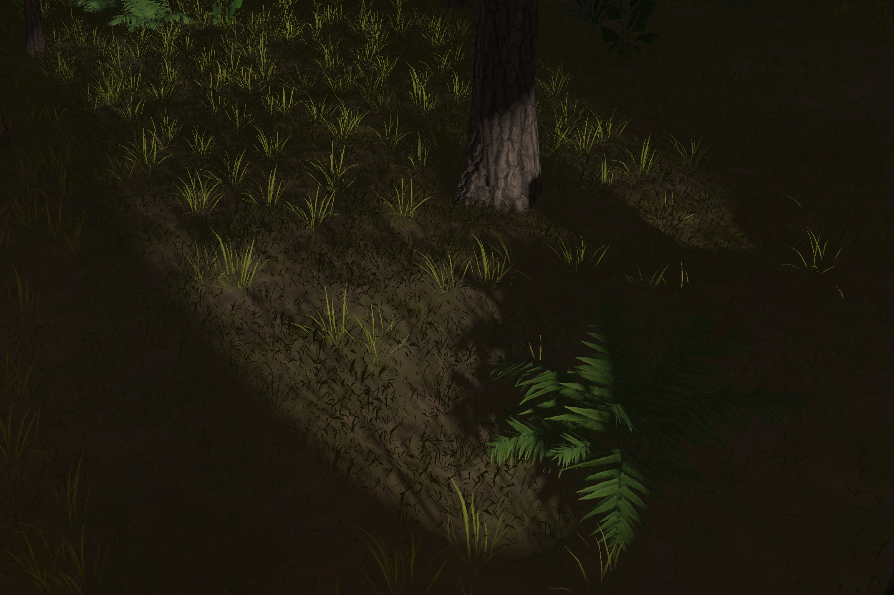
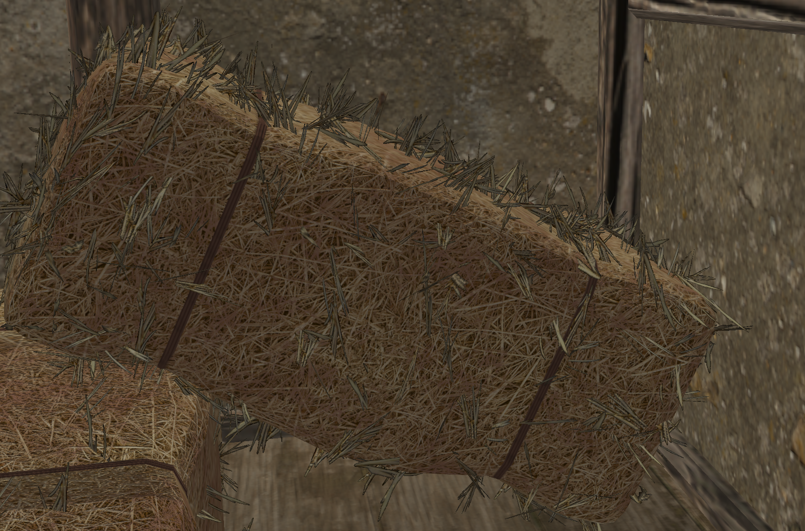
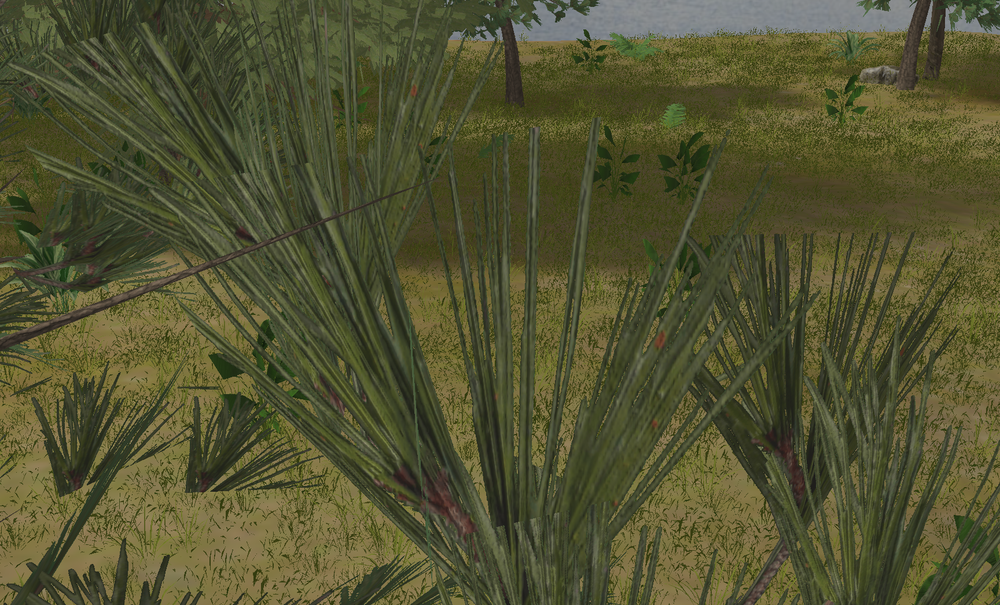

# OpenGL Advanced 3D Forest Environment

## Overview

This project presents a **highly realistic and interactive 3D forest environment** built with modern OpenGL. It demonstrates advanced real-time rendering techniques—such as **HDR**, **Bloom**, **Shadow Mapping**, **Normal Mapping**, **Rain**, **Fog**, **Wind**, and **Fire**—to create an immersive outdoor scenario. The environment integrates day/night cycles, audio synchronization, and performance optimizations (e.g., BVH culling, mesh batching) to maintain **real-time framerates** while delivering **detailed visuals**.

> **Important**: This repository **does not** include the large `.obj` files required to run the project (due to GitHub file size constraints). **If you wish to build and run the full application, please contact me directly for the necessary assets.**

---

## Features

1. **Dynamic Lighting & Shadow Mapping**  
   - **Directional Light** (sun/moon) with orthographic shadow maps  
   - **Point Light** (campfire) casting omnidirectional shadows  
   - **Spotlights** (flashlights/headlights) with perspective shadow maps  
   - **Blinn-Phong reflection** model with normal and specular maps  

2. **Environmental Effects**  
   - **Rain Simulation**: GPU-based raindrop particles with motion blur  
   - **Fog**: Layered or animated fog for atmospheric depth  
   - **Wind**: Perlin-noise–driven motion on vegetation (grass, leaves, ferns)  
   - **Fire & Smoke**: Realistic particle system for a flickering campfire  
   - **Lightning**: Periodic bright flashes with a random timing system and thunder audio  

3. **Post-Processing**  
   - **HDR** and **Tone Mapping** for extended color range  
   - **Bloom** for glowing highlights  
   - **Fragment Discard** for advanced transparency / dissolving effects  

4. **Audio Integration**  
   - **Rain Loop** with adjustable volume  
   - **Thunder** triggered after lightning flashes (random delay)  
   - **Campfire Crackling** (spatialized)  
   - **Global** or **spatial** sound management via miniaudio  

5. **Camera Navigation & Waypoint System**  
   - **Free-Fly Camera**: `WASD` + mouse look  
   - **Zoom** with mouse scroll  
   - **Pre-recorded Tour**: Save/load camera waypoints and interpolate camera through them for a cinematic tour  

6. **Scene Optimizations**  
   - **BVH (Bounding Volume Hierarchy)** to cull invisible objects  
   - **Frustum Culling**  
   - **Mesh Batching** to reduce draw calls  
   - **Texture Downscaling** and **meshoptimizer** geometry simplification  

---

## How to Build (Skeleton Instructions)

1. **Clone the Repository**  
   ```bash
   git clone https://github.com/ButasRafael/OpenGL-3D-Forest-Environment.git
   cd OpenGL-3D-Forest-Environment
   ```
   
2. **CMake Build**  
   ```bash
   mkdir build && cd build
   cmake ..
   make
   ```
   This generates the executable.  
   > Some steps (like linking libraries, copying shaders/textures) might require extra configuration.

3. **Run**  
   ```bash
   ./OpenGL-3D-Forest-Environment
   ```
   > The application may fail if it cannot find necessary assets. Please ensure `.obj` models and textures are in the correct relative paths or contact me to obtain them.

---

## Controls & Usage

| Key / Control     | Action                                            |
|-------------------|---------------------------------------------------|
| **W, A, S, D**    | Move camera forward/backward/left/right           |
| **Q, E**          | Move camera down/up                               |
| **Mouse**         | Look around (pitch, yaw)                          |
| **Mouse Scroll**  | Zoom (adjust camera FOV)                          |
| **ESC**           | Quit application                                  |

### Environment & Visuals

| Key        | Function                           |
|------------|------------------------------------|
| **R**      | Toggle Rain (+ rain sound)         |
| **F**      | Toggle Fog                         |
| **7**      | Toggle Wind effect                 |
| **H**      | Day/Night mode switch              |
| **3**      | Toggle directional light           |
| **4**      | Toggle campfire light (+ fire)     |
| **5**      | Toggle flashlight / spotlight      |
| **6**      | Toggle vehicle headlights          |

### Rendering & Post-Processing

| Key         | Function                              |
|-------------|---------------------------------------|
| **1**       | Wireframe mode                        |
| **2**       | Point mode                            |
| *(default)* | Fill mode                             |
| **B**       | Toggle Bloom                          |
| **N**       | Toggle Normal Mapping                 |
| **F4**      | Toggle HDR                            |
| **F5/F6**   | Increase/Decrease HDR Exposure        |

### Audio

| Key    | Function                                |
|--------|-----------------------------------------|
| **F2** | Increase volume (rain, thunder, fire)   |
| **F3** | Decrease volume (rain, thunder, fire)   |

---

## Future Improvements

- **Deferred Shading** or **PBR**: Migrate lighting to physically based rendering.  
- **Procedural Terrain** & **Vegetation**: Larger world expansions, GPU instancing for grass/trees.  
- **SSAO** or **Parallax Mapping**: Enhance contact shadows or surface depth.  
- **Animations**: Skeletal or keyframe animations for fauna or interactive objects.  

---

## Contact

For inquiries about obtaining the `.obj` files or any related questions, feel free to **open an issue** on this repository or **contact** me directly via email.

---

## Documentation

- [View Full Documentation](./Documentation.pdf)

---

## Screenshots

Here are some previews from the forest environment:

### Environment & Landscape
  
  
  
  

### Lighting & Shadows
  
  
  
  

### Weather & Atmospheric Effects
  
  
  

### Fire & Bloom
  
  
  
  

### Water & Reflection Effects
  
  
  

### Material & Surface Effects
  
  
  
  
  

---

## Known Issues & Limitations

- **Model Simplification Threshold**: Depending on your hardware, you may need to adjust the threshold parameter in the `Model3D` class’s optimized simplifier. This helps reduce mesh complexity for better performance, but if it’s too aggressive, it can degrade visual quality.
- **Hardware Requirements**: For full effects (HDR, bloom, etc.), a dedicated GPU with OpenGL 4.x support is recommended.

---

**Thank you for exploring this project!**  

